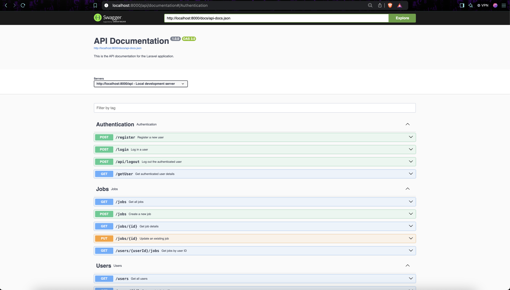
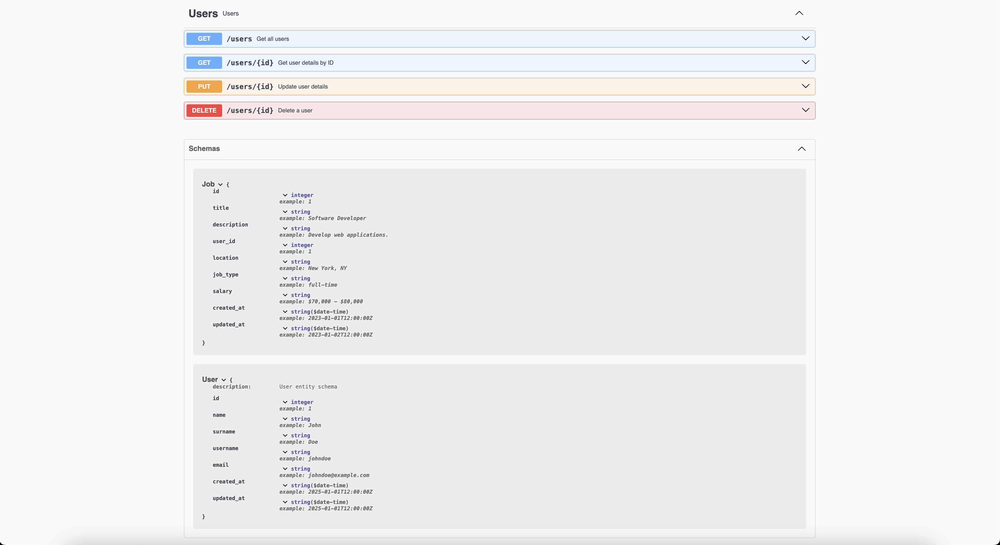
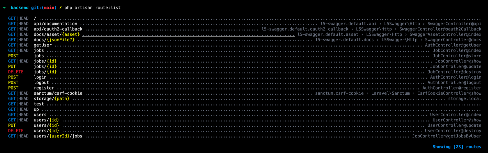
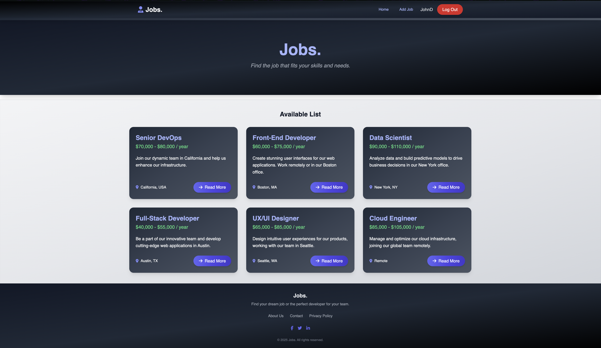
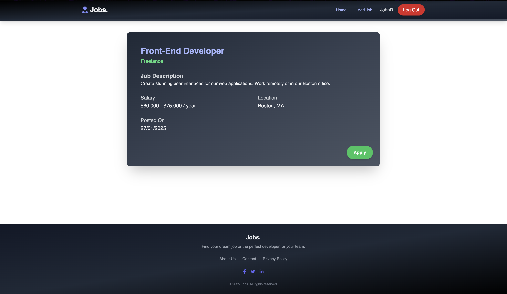
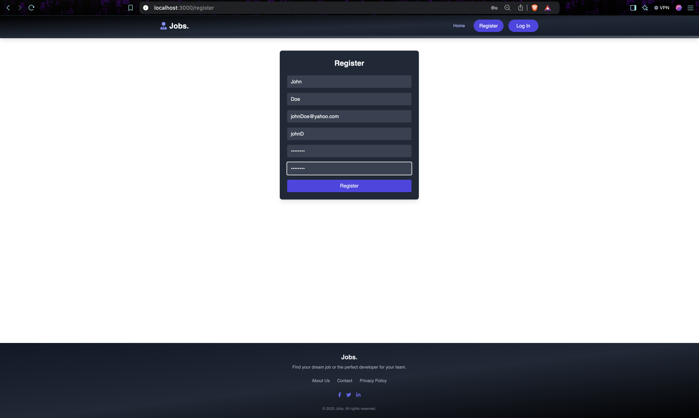
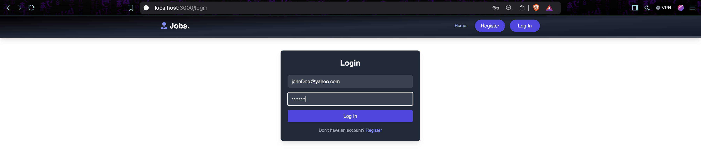
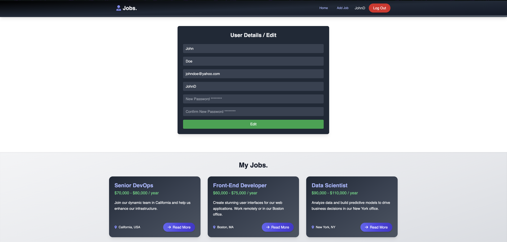
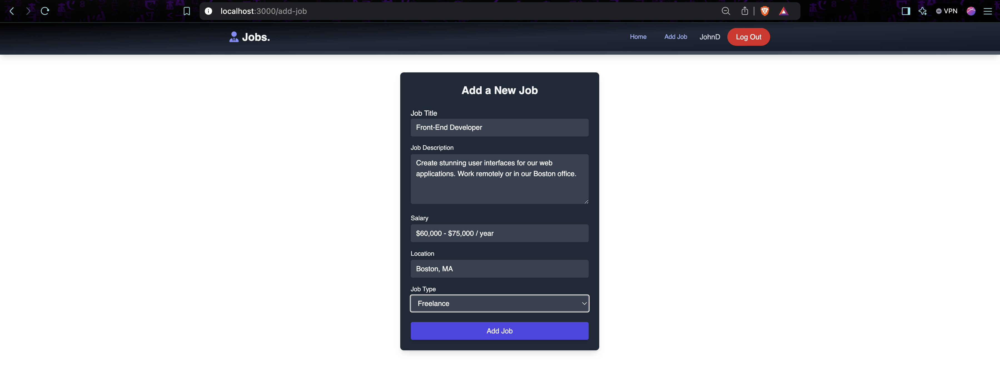

# JOBS
This SPA ad management application, built with Laravel (PHP) and React (TypeScript), includes user registration, authentication, and ads management (CRUD).    

The backend ensures robust security with features like CORS, sanitization, validation, CSRF protection, and token-based authentication.

### Build on
Build on MacOS Sequoia 15.0.1

## Files structure
```JOBS/
├── LICENSE
├── README.md
├── composer.json
├── composer.lock
├── docker-compose.yml
├── vendor/
├── backend/
│   ├── Dockerfile
│   ├── artisan
│   ├── composer.json
│   ├── composer.lock
│   ├── bootstrap/
│   │   └── app.php
│   ├── database/
│   │   ├── factories/
│   │   ├── migrations/
│   │   └── seeders/
│   ├── public/
│   │   └── index.php
│   ├── resources/
│   │   ├── css/
│   │   ├── js/
│   │   └── views/
│   ├── routes/
│   │   ├── api/
│   │   │   ├── auth.php
│   │   │   ├── jobs.php
│   │   │   └── users.php
│   │   ├── api.php
│   │   ├── console.php
│   │   └── web.php
│   ├── storage/
│   ├── tests/
│   ├── vendor/
│   ├── app/
│   │   ├── Http/
│   │   │   ├── Controllers/
│   │   │   │   ├── AuthController.php
│   │   │   │   ├── JobController.php
│   │   │   │   └── UserController.php
│   │   │   ├── Kernel.php
│   │   │   └── Middleware/
│   │   │       └── Authenticate.php
│   │   ├── Models/
│   │   │   ├── Job.php
│   │   │   └── User.php
│   │   ├── Providers/
│   │   │   ├── AppServiceProvider.php
│   │   │   └── RouteServiceProvider.php
│   │   └── Services/
│   │       ├── AuthService.php
│   │       ├── JobService.php
│   │       └── UserService.php
│   └── config/
├── frontend/
│   ├── Dockerfile
│   ├── index.html
│   ├── package.json
│   ├── postcss.config.js
│   ├── tailwind.config.js
│   ├── tsconfig.app.json
│   ├── tsconfig.json
│   ├── tsconfig.node.json
│   ├── vite.config.ts
│   ├── public/
│   ├── src/
│   │   ├── App.tsx
│   │   ├── main.tsx
│   │   ├── index.css
│   │   ├── assets/
│   │   ├── components/
│   │   │   ├── Footer.tsx
│   │   │   ├── Header.tsx
│   │   │   ├── Hero.tsx
│   │   │   ├── JobListingCard.tsx
│   │   │   ├── JobListings.tsx
│   │   │   ├── Message.tsx
│   │   │   ├── PrivateRoute.tsx
│   │   │   ├── Spinner.tsx
│   │   │   ├── ViewAllJobsButton.tsx
│   │   │   └── pages/
│   │   │       ├── AddJob.tsx
│   │   │       ├── Home.tsx
│   │   │       ├── JobDetail.tsx
│   │   │       ├── Login.tsx
│   │   │       ├── Register.tsx
│   │   │       ├── UserDetail.tsx
│   │   │       └── static/
│   │   │           ├── AboutUs.tsx
│   │   │           ├── Contact.tsx
│   │   │           └── PrivacyPolicy.tsx
│   │   ├── constants/
│   │   │   └── constants.ts
│   │   ├── context/
│   │   │   └── AuthContext.tsx
│   │   ├── styles/
│   │   │   └── globals.css
│   │   ├── types/
│   │   │   └── Types.ts
│   │   └── utils/
│   │       └── validations.ts

```

## Backend Architecture
The backend is built using PHP (Laravel) and follows a service-oriented architecture for modularity and scalability.  
Key features include:

Authentication: Implements user registration and login using Sanctum.  

- RESTful API: Includes endpoints for jobs/ads and user management.
- Database Management: Uses migrations and Eloquent ORM for database interaction.
- Service Layer: Abstracts business logic into services for better maintainability.
- Swagger Documentation: Provides API documentation for developers.
  
Directory Structure:
- Controllers: Handles HTTP requests and responses.
- Models: Represents database entities (e.g., User, Job).
- Services: Encapsulates business logic (e.g., AuthService, JobService).
- Routes: Defines API endpoints (api.php).

## Frontend Architecture
The frontend is built with React (TypeScript) and utilizes Tailwind CSS for styling. It provides a responsive, interactive GUI with the following structure:  

- Pages: Implements individual views (e.g., Home, Login, Article Detail).
- Components: Reusable UI elements like Header, Footer, JobListingCard.
- Context: Global state management using AuthContext.
- Services: Handles API communication (e.g., authService, articleService).
- Utilities: Includes validation logic and helper functions.
- Routing: Uses React Router for navigation between pages.

## Step-by-Step Setup

1. Clone the Repository
First open a new terminal window and clone the repository:
```bash
git clone https://github.com/jaroslavdusek1/JOBS
cd blog_app
```

2. Run the Application with Docker
Run Docker in a Single Command Sequence
For Linux:
```bash
sudo systemctl start docker && sudo systemctl status docker && docker --version
```

For macOS:
On macOS, Docker Desktop needs to be launched manually. Use this command to check Docker's version and confirm it's running:
```bash
docker --version
```

3. This project requires Node.js v16 (or newer). You can verify your installed version by running:
```bash
node --version
```

or download NVM (node package manager) and change the current version with cmnd:
```bash
nvm use <VERSION>
```


4. After confirming Docker is running, navigate to the directory containing your docker-compose.yml (root /) file and run the application (macOS && linux):
```bash
docker-compose up --build
```

5. After the build is complete, you can run:
```bash
docker-compose up -d
```

The application will start and be accessible at:

Frontend: [http://localhost:3000](http://localhost:3000)  
Backend: [http://localhost:3000](http://localhost:8000)  
Swagger API Docs: [http://localhost:3000/api-docs](http://localhost:3000/api-docs)

### Verify a running application via netstat:
```bash
Linux/Mac
netstat -tuln | grep 3000
netstat -tuln | grep 8000

On Mac (Alternative with lsof):
lsof -i :3000
lsof -i :8000
```

If your services are running, you should see output similar to this:
```bash
tcp        0      0 0.0.0.0:3000          0.0.0.0:*             LISTEN
tcp        0      0 0.0.0.0:8000          0.0.0.0:*             LISTEN

or

com.docke 59731   jd  185u  IPv6 0x6aeaeae6b75ab14b      0t0  TCP *:hbci (LISTEN)
com.docke 59731   jd  187u  IPv6 0x6d670f0a0a8687f0      0t0  TCP *:redwood-broker (LISTEN)
```

## Development Setup
To run the backend or frontend locally:

### Backend
1. Navigate to the backend folder:
```bash
cd backend
```

2. Install dependencies:
```bash
composer install
```

3. Start the backend
```bash
php artisan serve
```

### Frontend (React + Vite)
1. Navigate to the frontend folder:
```bash
cd frontend
```

2. Install dependencies:
```bash
npm install
```

3. Start the backend
```bash
npm run dev
```

## Check docker containers
```bash
docker ps

result supposed to be like this below:

CONTAINER ID   IMAGE           COMMAND                  CREATED          STATUS          PORTS                    NAMES
af2e821a0b36   jobs-frontend   "docker-entrypoint.s…"   44 minutes ago   Up 44 minutes   0.0.0.0:3000->3000/tcp   jobs-frontend
50004cdebd17   jobs-backend    "docker-php-entrypoi…"   44 minutes ago   Up 44 minutes   0.0.0.0:8000->8000/tcp   jobs-backend
7d05c673f032   postgres:15     "docker-entrypoint.s…"   44 minutes ago   Up 44 minutes   0.0.0.0:5432->5432/tcp   jobs-db

```

## Access DB container/jobs database
```bash
docker exec -it jobs-db /bin/bash

root@7d05c673f032:/# psql -U postgres
psql (15.10 (Debian 15.10-1.pgdg120+1))

postgres=# \c jobs
You are now connected to database "jobs" as user "postgres".
jobs=# \dt
                 List of relations
 Schema |          Name          | Type  |  Owner   
--------+------------------------+-------+----------
 public | jobs                   | table | postgres
 public | migrations             | table | postgres
 public | personal_access_tokens | table | postgres
 public | users                  | table | postgres
(4 rows) 
```

## API Endpoints Documentation

Swagger Documentation: [http://localhost:3000/api-docs](http://localhost:8000/api/documentation#/)
Here, you can view and test the available REST API endpoints.


  

### PHP Artisan BE Router


## JOBs
### Home Page


### Job Detail


### Register


### Login


### User Profile


### Add Job



Enjoy :]
